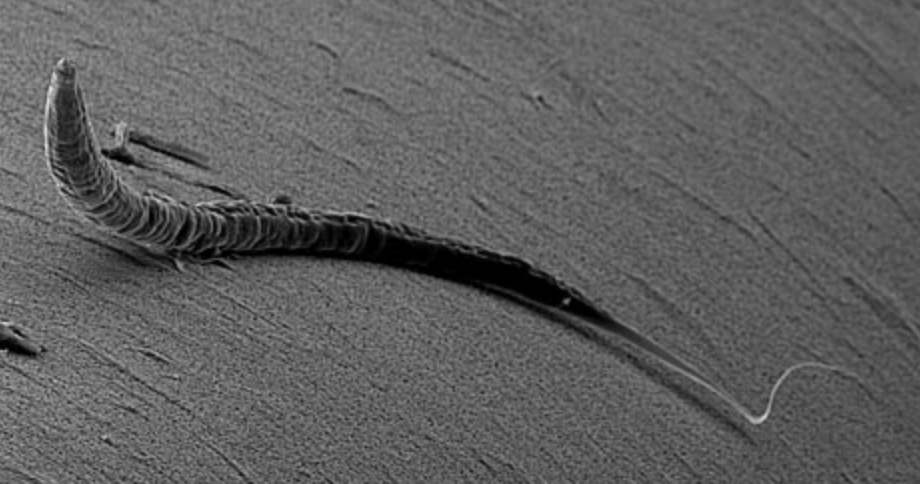
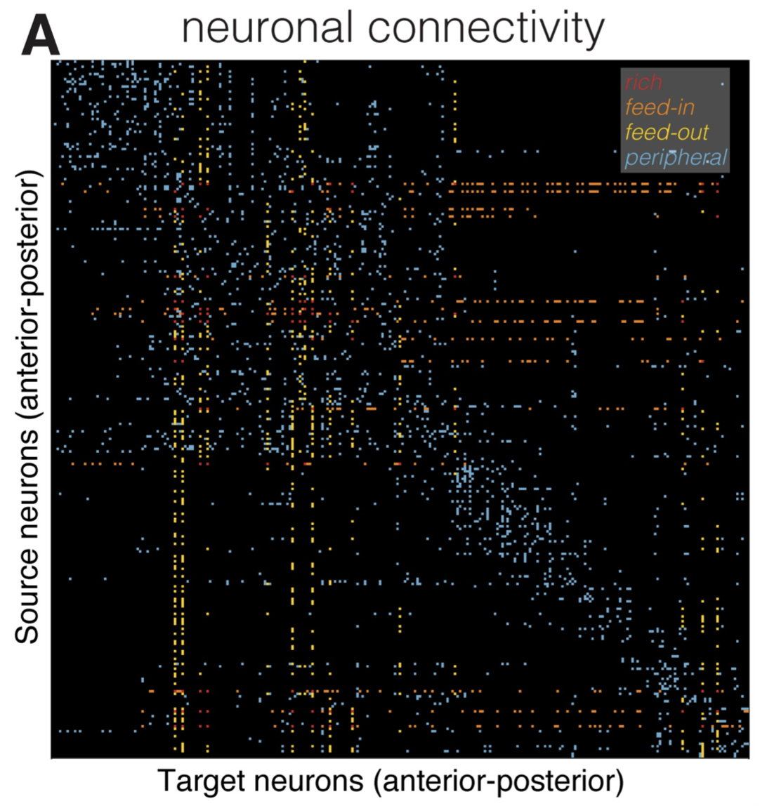
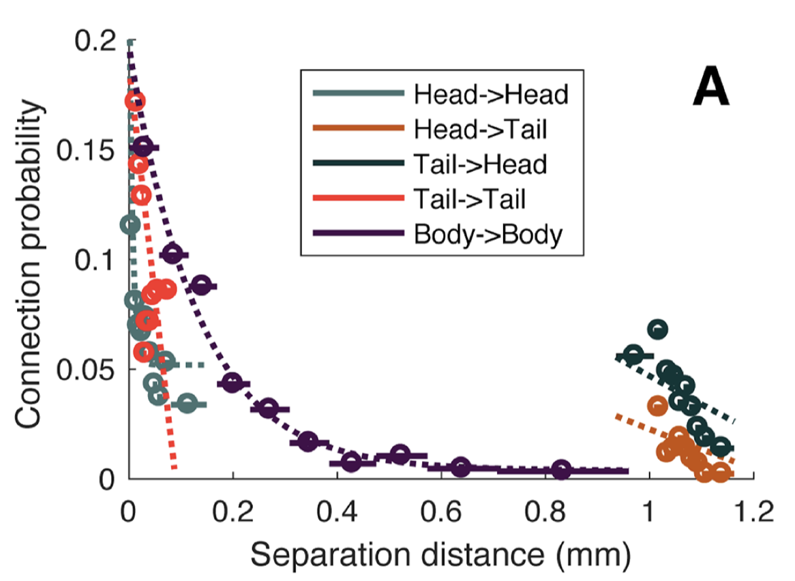
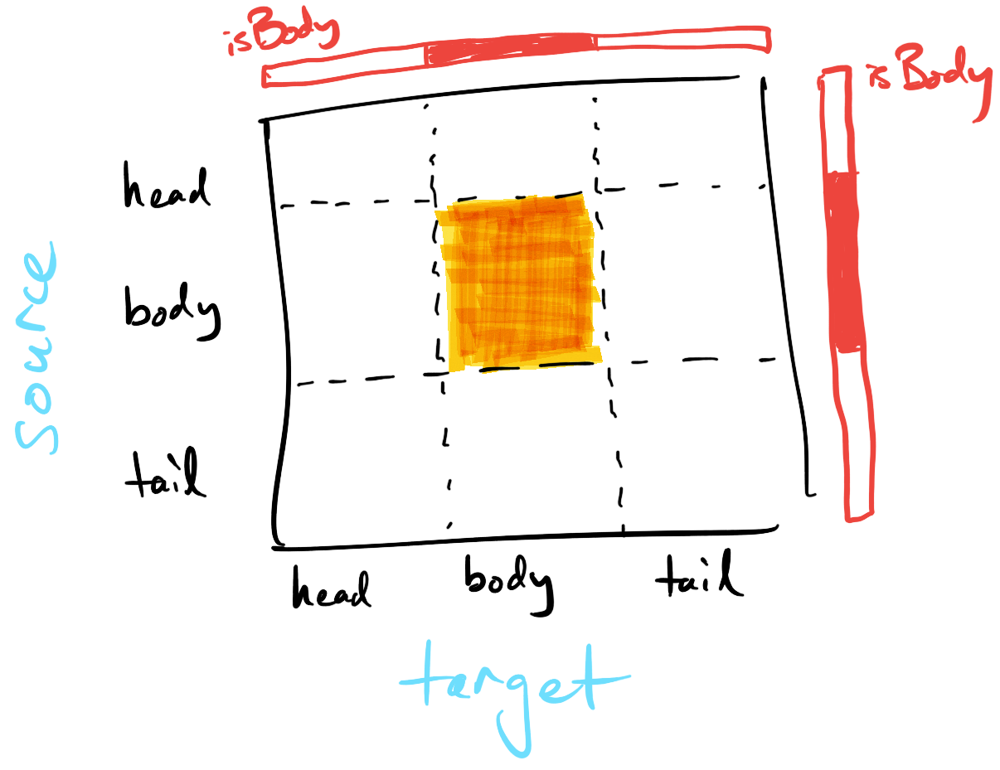

# Complex Networks Analysis of Neuronal Connectivity in _C. Elegans_ :bug::bug::bug:

This tutorial will walk you through a basic understanding of complex networks.

## Getting Started: General PHYS3888 tutorial info

Like all PHYS3888 tutorials, questions requiring an answer to be input to the Canvas quiz are labeled as '':question::question::question:''.
Optional questions are labeled '':yum:'' (just for fun) and optional advanced questions are labeled as '':fire:''.

Before you get started, download all the material for this tutorial to your computer by pressing the green "Code" button above, and click "Download as zip".
Open Matlab and navigate to the directory you saved the files to, and then work through the tutorial in Matlab, following the instructions in this browser window (which renders the instructions contained in `README.md`).

## Intro

Networks are a representation of objects (nodes) and the connections between pairs of nodes (edges).

As an example dataset we will use the network of neurons, and their connectivity in the nematode worm, _C. elegans_ :bug:, measured through painstaking reconstruction from electron microscopy.
Note that the network of connectivity between elements of the brain is called a _connectome_.



This data has been analyzed by many physicists (and other scientists).
This tutorial follows results from [this recent paper](http://dx.plos.org/10.1371/journal.pcbi.1005989), and is presented in three parts:

1. Representing and visualizing networks
2. Computing network properties
3. Physical embedding

## PRE-WORK: Basic matrix manipulations

In this section you will brush up on a few basic commands for reordering, subsetting, and summing vectors/matrices in Matlab.
Aim to get this done before the tutorial so that you can focus your in-class time on the core material rather than coding syntax.

Let's start with a 5x5 matrix:

```matlab
M = magic(5);
```

### Reordering rows/columns of a matrix

Let's reorder the rows according to the ordering defined by: `[1,4,3,5,2]`:

```matlab
ix = [1,4,3,5,2];
M_row = M(ix,:)
```

Verify how the order of the rows of `M` have been permuted as specified by the `ix` permutation, and the result stored in the new, row-reordered matrix, `M_row`.
We could do the same to the columns as `M_col = M(:,ix)`.
And we can reorder both together as `M_both = M(ix,ix)`

### Producing a permutation by sorting

What if we want to sort the rows `M` according to its first column?
Let's look at the first column: `M(:,1)`.
We can get this permutation using the `sort` function, as:

```matlab
[~,ix] = sort(M(:,1),'ascend')
```

Our permutation is the second output of this function, as `ix`, and we have ignored the first output by using a `~` in its place.

Now we can use this permutation, `ix`, to sort the rows of M as: `M_sort = M(ix,:)`.

### Subsetting

What if we want to keep only a subset of rows/columns of `M`?
One way is to define a logical indicator for the rows we want to keep:

```matlab
keepMe = [false,false,true,true,false];
```

Then we can keep just these rows (but all columns), as `M_row = M(keepMe,:)`.
We can keep just these columns (but all rows), as `M_col = M(:,keepMe)`.
We can do both at once as `M_both = M(keepMe,keepMe)`.

Note that the same results as above would be obtained if we instead defined the indices we want to keep: `keepMe = [3,4]`.

### Summing elements of a matrix

#### Rows/columns

Let's keep the first four columns of M.
I'm sure you knew that you can do this as `M_cut = M(:,1:4)`

Recall that you can compute the sum of each column as `sum(M_cut,1)` (the `1` specifies summing down the first dimension: each sum is a sum over rows).
Verify that this yields a row vector of length 4: one per column of `M_cut`.
Because the columns of `M_cut` are from a magic square, these columns should all sum to 65.

What about for the rows? We can do `sum(M_cut,2)`, specifying `2` to specify a sum across columns.
We get a number for each row, and this therefore should be a 5-long column vector.

Other Matlab functions can be applied across rows or columns of a matrix in a similar way, including `mean`.

#### All elements

What if we want to sum everything in a matrix?
We can do this by a double sum, e.g., `sum(sum(M))`, which first sums the rows and then sums these sums.

We could achieve the same thing by stretching `M` out into one long vector, as `M(:)`, and then summing this: `sum(M(:))`.
There is also the `'all'` setting in `sum` that gives another way of the doing the same computation: `sum(M,'all')`.

---

## Part 1: Representing and visualizing networks

Ok, let's get into it.

First load in the _C. elegans_ connectivity data using the function `LoadCElegansData`:

```matlab
[adjMatrix,neuronNames,positionXY] = LoadCElegansData();
```

The variable `adjMatrix` represents the adjacency matrix of the network.
This contains information about all connections from every neuron (row) to every other neuron (column).

### Plotting an adjacency matrix as an image

When analyzing any type of data, your habit should be to start by getting a good visualization of it.
Starting an analysis with a comprehensive visualization can help identify any issues with the data, and can motivate the most suitable types of analysis to perform on it.

Let's start with plotting the adjacency matrix as an image, using the `imagesc` function.
Take a look inside the `PlotAdjacencyMatrix` function to see the simple set of commands to generate this plot:

```matlab
PlotAdjacencyMatrix(adjMatrix)
```

This is the adjacency matrix representation of the _C. elegans_ connectome, where every neuron is a row (and a column), and edges are shown white.
The plot reveals complex connectivity patterns between pairs of neurons in _C. elegans_.

#### Plotting a sorted adjacency matrix

In their 2018 paper, Arnatkeviciute et al. plotted the same data in Figure 1A, shown here:



If it is the exact same data, then why does it look so different to what we plotted?

Plots can be deceiving---sometimes random data can be plotted in a way that appears to the human eye to contain non-random structure.
On closer inspection, we find that Arnatkeviciute  et al. (2018) ordered their matrix by the position from head-to-tail (called the 'anterior-posterior' axis).
The spatial co-ordinates of each neuron is in the variable `positionXY`.
The first column of `positionXY` is the `x`-coordinates (broadly from head to tail), and the second column contains the `y`-coordinates.

#### Sorting neurons head-to-tail

Reorder the adjacency matrix so that neurons are ordered according to their position from head-to-tail, then plot this matrix by passing it into the `PlotAdjacencyMatrix` function.
Verify that the result matches the result from Arnatkeviciute et al. (2018) (ignoring coloring)?

_Hint:_ Use the `sort` function to get the permutation corresponding to the desired reordering (as in the pre-work).

:question::question::question: __Q1:__ Upload the lines of code you used to construct your reordered matrix.

__Note__: The remainder of this tutorial will work with the original (unordered) matrix, `adjMatrix`.

### Plotting the network in physical space

Let's visualize the adjacency matrix as a ball-and-stick representation:

```matlab
G = digraph(adjMatrix); % construct a graph object
p = plot(G); % plot the graph
```

Do you know what you're looking at?!
Zoom in and have a play :mag::smiley:

Note that this visualization is in an abstract space, that is, the coordinates don't correspond to physical space.
But we have two-dimensional coordinates for every neuron, `positionXY`, that we can use to plot the network information in physical space:

```matlab
figure('color','w')
p = plot(G,'XData',positionXY(:,1),'YData',positionXY(:,2));
p.Marker = 'o'; % plot each neuron as a circle
p.NodeColor = 'r'; % make circles red
p.MarkerSize = 6; % make circles size 6
axis('equal') % make horizontal and vertical scales comparable
```

You can zoom in on this physical connectome plot to explore the cluster of head neurons (towards the left), and the cluster of tail neurons (towards the right).
Body neurons are scattered through the length of the nematode worm.

You can retrieve the labeling of neurons using the `GiveMeNeuronLabels` function, which labels head neurons as `1`, body neurons as `2`, and tail neurons as `3`).
Use this information to adjust the physical connectome plot above to color head, body, and tail neurons a different color by setting the `p.NodeCData` property.

---

## Part 2: Computing network properties

We can ask many basic questions by running simple operations on the adjacency matrix.

#### How many neurons?

:question::question::question: __Q2:__ From the size of the adjacency matrix, determine how many neurons there are.

#### Is the network binary or weighted?

Recall the difference between a binary and a weighted network.
Do a simple test to determine whether the network captured in `adjMatrix` is binary or weighted.
(_Hint:_ one way is to use the `unique()` function).

#### Is the network directed or undirected?

Recall the difference between an undirected and a directed network.
Verify that the code below tests for directedness:

```matlab
symmetricMatches = (adjMatrix'==adjMatrix);
```

What should you look for in the `symmetricMatches` matrix?

#### Does the connectome contain self-connections?

Where do self-connections show up in the adjacency matrix?
Use the `diag()` function to determine whether `adjMatrix` contains self-connections.

#### How many edges are in the connectome?

Use the `sum()` command to count the total number of edges.
Do you need to divide this number by 2?
Why/why not?

:question::question::question: __Q3:__ How many edges are in the _C. elegans_ connectome?

#### In-degree, `kIn`, and out-degree, `kOut`

How many inward-coming connections does each neuron have, its _in-degree_, `kIn`?
What about the total number of outward-going connections, its _out-degree_, `kOut`?

Since each neuron is a row and a column, we can compute degree using sums.
This adjacency matrix has source neurons as rows, and target neurons as columns.
Thus we can compute the in-degree, `kIn`, as the number of sources (rows) coming into a given target (column) by summing down each column:

```matlab
kIn = sum(adjMatrix,1); % dimension 1: sum down columns
```

Similarly for `kOut`, as the number of targets (columns) for a given source (row):

```matlab
kOut = sum(adjMatrix,2); % dimension 2: sum across rows
```

The total number of connections involving a neuron (both outgoing and incoming) can be computed as the sum of these two quantities, the total degree, `kTot`:

```matlab
kTot = kIn + kOut';
```

(we need to transpose `kOut` using `'` to match the dimensions for the sum).

Recall that in a random network, there is a tight distribution about the mean degree.
If neurons connect at random, this would mean that most neurons will have a similar number of connections, with a tight spread around a mean value (a Binomial/Poisson distribution).

We can test this by plotting the degree distribution to see how connectivity is distributed across neurons:

```matlab
PlotDistribution(kTot,20); % use 20 bins in the histogram
xlabel('Total degree, kTot')
```

:question::question::question: __Q4:__ What about this distribution tells us that there are highly connected hub neurons in the _C. elegans_ connectome?

#### What do the hub neurons do?

The most complex behavior in _C. elegans_ is its locomotion, which is governed by a set of ten _"command interneurons"_, which control both forward (neurons: AVBL, AVBR, PVCL, PVCR) and backward (neurons: AVAL, AVAR, AVDL, AVDR, AVEL, AVER). [If you're interested you can [read more here](https://www.frontiersin.org/articles/10.3389/fncom.2013.00128/full)].

I wonder if any of these show up in our list of highly-connected hub neurons...? :smirk:

We can first sort neurons from the most to the least connected by applying the `sort` function to `kTot` and specifying `descend`:

```matlab
[~,ix] = sort(kTot,'descend');
```

This second output, `ix`, gives us the permutation that sorts neurons from the most connected (`ix(1)`) to the least connected (`ix(end)`).

So now we can use this `ix` to list the top ten:

```matlab
ListTen(neuronNames,kTot,ix)
```

Is there overlap between the neurons that control the worm's locomotion and the neurons that are most strongly connected in the network?

:question::question::question: __Q5:__ Select all of the hub neurons that are also part of the locomotion system of _C. elegans_.

---

## Part 3: Physical embedding

The worm's nervous system is a physical system that spans a head, body, and tail.
Representing it abstractly as a set of nodes and edges ignores this spatial information.
As physicists, we are interested in characterizing the physical rules that might shape neuronal connectivity in _C. elegans_.

Take a look at Fig. 3A in Arnatkeviciute et al. (2018), shown below, which reveals a decrease in connection probability with the distance between pairs of neurons.
This means that pairs of neurons that are physically close to each other are more likely to be connected than those that are far apart.
You can see that this relationship is clearest for connections between body neurons (body -> body, shown purple).



Let's try to reproduce this finding in the body neurons of the _C. elegans_ nervous system. :satisfied:

### A worm body connectome

Because we're only interested in body neurons, our first step is to filter down the adjacency matrix to only contain body neurons.
Check out the sketch below of the different parts of the adjacency matrix to understand what we're trying to do.
The part of the adjacency matrix that we're trying to isolate (shaded yellow) is where both the source and target are body neurons.



As shown in the sketch, we need can start by constructing a _binary indicator_ for body neurons: this variable should be `true` for body neurons and `false` for head or tail neurons.
Because `GiveMeNeuronLabels()` labels body neurons as `2`, we can do this by finding where this indicator equals 2.
Make sure you understand how this is achieved using the following code:

```matlab
neuronLabels = GiveMeNeuronLabels(); % Labels neurons in the body as '2'
isBodyNeuron = (neuronLabels==2); % Construct a binary indicator for body neurons
```

Use the `isBodyNeuron` indicator to reduce the full adjacency matrix down to include information about body neurons only, as a new adjacency matrix, `adjMatrixBody`.

:question::question::question: __Q6:__
How many connections exist between the body neurons of _C. elegans_?

:question::question::question: __Q7:__
In the sketch above, identify the part of the adjacency matrix that corresponds to connections _from_ body neurons _to_ head neurons.
By constructing an indicator for head neurons, as `isHeadNeuron = (neuronLabels==1);`, compute the total number of connections made _from_ a body neuron to a head neuron.

#### :yum: [Optional]: Visualize body-body neuron connectivity :yum:

Visualize interconnectivity between the worm's body neurons using `imagesc()` (as we did for the full network above).
From this plot, give a rough visual estimate of the probability that if a pair of neurons are connected, this connection is reciprocal?

To assess your visual estimate, you can compute the true value by running the function `whatProportionReciprocal(adjMatrixBody)`.

Was your estimate close?

#### Converting coordinates to Euclidean distances

Ok, now that we have the connectivity information for body neurons in `adjMatrixBody`, we need their physical separation distances.

1. Reduce the coordinates for all neurons, `positionXY`, to those just for body neurons using the `isBodyNeuron` indicator.
Store the result in the variable `positionXY_body`.
2. Convert these body-neuron coordinates into Euclidean distances using the `pdist` function. Use the `squareform` function to convert these distances into a matrix and store them in a new variable, `distMatrixBody`.

### Estimating connection probabilities

Ok, so now we have a physical distance for all pairs of body neurons, `distMatrixBody`, and whether a connection exists or not, `adjMatrixBody`.
We can now proceed to compute the probability that two neurons will be connected as a function of their separation distance.

Calculating probabilities are easy with binary data, because we can compute the probability of being a `1` directly as the mean of a binary vector.
Do you see how this works?
Consider a vector with 50% 1s: `mean([1,1,0,0]) = 0.5`, or a vector with 80% 1s: `mean([1,1,1,1,0]) = 0.8`.
We use this property of averaging binary indicators to compute the connection probability.

### Connection probability as a function of distance

Now we want to compute the probability that a connection exists in __each of 10 equally-spaced distance bins__.

The `makeBins` function computes a set of equally spaced distance bins across the given set of distances (e.g., `distMatrixBody`) and, for pairs of neurons in each distance bin, computes the probability that connections exist between them (e.g., using `adjMatrixBody`).

Set `numBins` and then run `makeBins` as below:

```matlab
% The makeBins function hides the dirty work
% (including removing self-connections from the computation):
[distBinCenters,connProb] = makeBins(distMatrixBody,adjMatrixBody,numBins);
```

Now we can plot the connection probability, `connProb`, as a function of distance in the worm's body:

```matlab
f = figure('color','w');
plot(distBinCenters,connProb,'o-k')
xlabel('Separation distance (mm)')
ylabel('Connection probability')
```

How does connection probability depend on separation distance in _C. elegans_?

We can also check the validity of the famous _exponential distance rule_ in systems neuroscience by fitting an exponential, `f(x) = A exp(-n x)` to the data:

```matlab
[expFittedData,A,n] = fitExponential(distBinCenters',connProb');

% And now we can plot the data and the exponential together:
f = figure('color','w');
hold('on')
plot(distBinCenters,connProb,'o-k')
plot(distBinCenters,expFittedData,'--b')
% We are well-trained scientists, so we always label our axes and all objects on our plots:
legend('Binned Data','Fitted Exponential')
xlabel('Separation distance (mm)')
ylabel('Connection probability')
```

You'll see that the `fitExponential` function has three outputs.
Look inside the `fitExponential` function to understand what they are.

:question::question::question: __Q8:__
What is your fitted exponential decay rate (/mm)?
Give your answer to 1 decimal place.

[_Note_: Don't worry if your lab partner gets a slightly different answer—different versions of Matlab can give slightly different answers]

:question::question::question: __Q9:__
True or False: The data approximately follow an exponential __decay__.
A pair of nearby neurons is __more likely__ to be connected than a pair of distant neurons.

---

#### :fire: Optional challenge :fire:: connection probability

Challenge: Repeat for the head :arrow_right: tail, and tail :arrow_right: head results.
