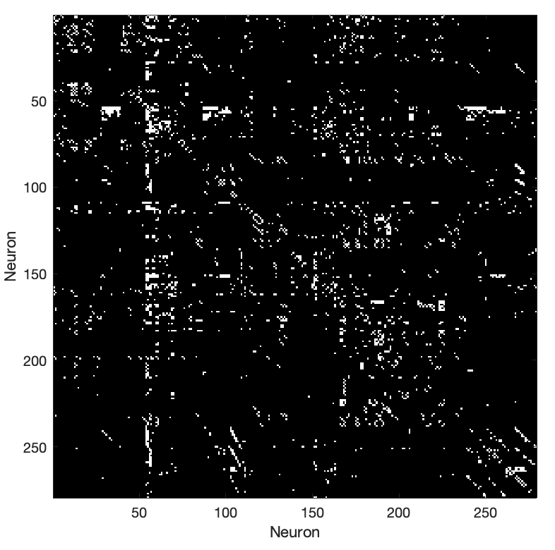
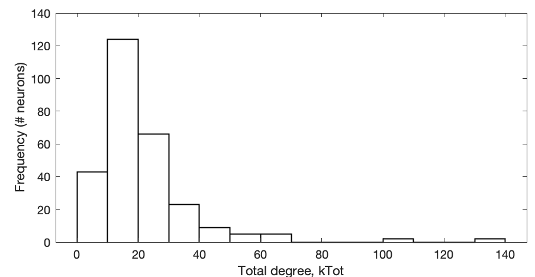

# Complex Networks

This tutorial will walk you through a basic understanding of complex networks.

Networks are a representation of objects (nodes) and the connections between pairs of nodes (edges).

As an example dataset we will use the network of neurons, and their connectivity in the  connectome of the nematode worm, C. elegans.

This data has been analyzed by many network scientists including in [this recent paper](http://dx.plos.org/10.1371/journal.pcbi.1005989).

## Representing networks

First load in the C. elegans connectivity data using the pre-written function `LoadCElegansData`:
```matlab
[adjAll,neuronNames,positionXY] = LoadCElegansData();
```

The variable `adjAll` contains information about all connections from every neuron (row) to every other neuron (column).

### Plotting a network

When analyzing any type of data, your habit should be to start by getting a good visualization of it.
Starting an analysis with a comprehensive visualization can help identify any issues with the data, and can motivate the most suitable types of analysis to perform on it.

Let's start with plotting the adjacency matrix as an image:
```matlab
figure('color','w')
imagesc(adjAll)
colormap('gray')
axis('square')
xlabel('Neuron')
ylabel('Neuron')
```


This is the adjacency matrix representation of the C. elegans connectome, where every neuron is a row/column, and edges represent the complex connectivity patterns between pairs of neurons.

---

#### TASK

Why doesn't this matrix match that plotted in Fig. 1A of Arnatkeviciute et al.
Arnatkeviciute have colored each edge differently, but the edges themselves don't appear to match:


_Hint_: Try reordering the network so that neurons are ordered according to their position from head-to-tail?
The relevant coordinate is `C.Pos(:,1)`

---

What about representing the same information as a graph?

```matlab
G = digraph(adjAll); % construct a graph object
p = plot(G); % plot the graph
```


We have two-dimensional coordinates for every neuron, `positionXY`, so we can also plot this in a representation of real space:

```matlab
figure('color','w')
p = plot(G,'XData',positionXY(:,1),'YData',positionXY(:,2))
axis('equal')
p.Marker = 'o';
p.NodeColor = 'r';
p.MarkerSize = 6;
```
You can zoom in to explore the cluster of head neurons to the left of the plot, and the cluster of tail neurons towards the right of the plot, with body neurons scattered through the length of the worm.

---

#### TASK: Distinguishing head/body/tail neurons in the plot

Can you adjust the plot above to color head, body, and tail neurons a different color?
_Note:_ You can retrieve the labeling of neurons as a categorical using the function `GiveMeNeuronLabels` (head = 1, body = 2, tail = 3).
You can set node colors using `p.NodeCData = numericLabels`, for a given set of numeric labels.

---

### Basic network statistics

We can ask many basic questions by running simple operations on the adjacency matrix.

How many neurons are there?
```matlab
size(adjAll)
length(neuronNames)
```

How many edges are there?
```matlab
sum(adjAll(:))
```

How many inward-coming/outward-going connections does each neuron have (its in-degree, `kIn`, or out-degree, `kOut`)?
The total number of connections involving a neuron can be computed as the sum of these two quantities, the total degree `kTot`.
```matlab
kIn = sum(adjAll,1);
kOut = sum(adjAll,2)';
kTot = kIn + kOut;
```

Plot the degree distribution:
```matlab
f = figure('color','w');
h = histogram(kTot);
h.FaceColor = 'w';
h.EdgeColor = 'k';
h.LineWidth = 1;
xlabel('Total degree, kTot')
ylabel('Frequency (# neurons)')
```



This is not a Gaussian distribution; there is a heavy tail with some strongly connected neurons at the upper end of connectivity.
These high-degree neurons are known as 'hubs'.

The most complex behavior in C. elegans is its locomotion, which is governed by a set of ten "command interneurons", which control both forward (neurons: AVBL, AVBR, PVCL, PVCR) and backward (neurons: AVAL, AVAR, AVDL, AVDR, AVEL, AVER) (FYI: read more [here](https://www.frontiersin.org/articles/10.3389/fncom.2013.00128/full)).

I wonder if any of these show up in our list of highly connected neurons.
Let's list the top ten to see:
```matlab
[~,ix] = sort(kTot,'descend');
for i = 1:10
    fprintf(1,'%s, k = %u\n',neuronNames{ix(i)},kTot(ix(i)))
end
```

### Symmetrizing a graph

The C. elegans connectome contains directed information---not all connections go in both directions.
Because of this, some connections exist i -> j, for which the reverse connection, j -> i, does not exist.
Thus, the matrix, `adjAll`, is not symmetric.

We can form a symmetrized version of the network (an undirected graph) efficiently by keeping an edge when there is either connection i->j OR j->i using the OR operator `|` with the transpose of the adjacency matrix:

```matlab
adjAllSym = (adjAll | adjAll');
```

We can plot the symmetrized graph:
```matlab
G = graph(adjAllSym); % construct a graph object
p = plot(G); % plot the graph
% Adjust some of the plotting properties:
p.Marker = 'o';
p.NodeColor = 'r';
p.MarkerSize = 8;
```

### Spatial embedding
