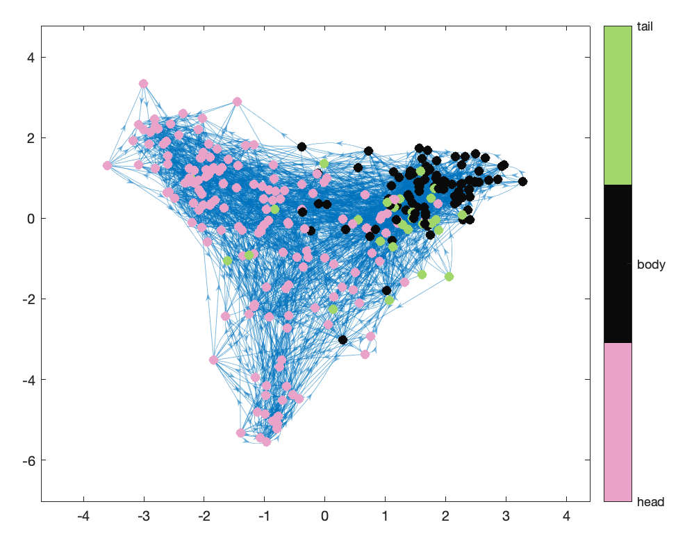

#### Task: Reordering an adjacency matrix

```matlab
[~,ix] = sort(C.Pos(:,1),'descend'); % head-to-tail
adjSorted = adjAll(ix,ix);
imagesc(adjSorted)
colormap('gray')
axis('square')
xlabel('Neuron')
ylabel('Neuron')
```

#### Task: Distinguishing head/body/tail neurons

```matlab
figure('color','w')
G.Nodes.NodeColors = GiveMeNeuronLabels;
p = plot(G); % plot the graph
p.NodeCData = G.Nodes.NodeColors;
p.MarkerSize = 6;
colormap([233, 163, 201;
            10, 10, 10;
            161, 215, 106]/255)
cB = colorbar();
cB.Ticks = [1,2,3];
cB.TickLabels = {'head','body','tail'};
```

